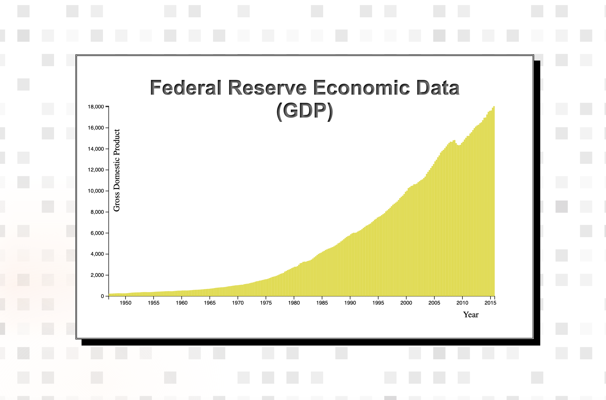

# DATA VISUALIZATION PROJECTS | VISUALIZE DATA WITH A BAR CHART

> This is the first project of _freeCodeCamp "Data Visualization Projects" Certification_

## Technology Stack

- **HTML**
- **JavaScript**
- **CSS**
- **D3**

## SUMMARY

Fulfill the below user stories and get all of the tests to pass. Give it your own personal style.

The tests require axes to be generated using the D3 axis property, which automatically generates ticks along the axis. These ticks are required for passing the D3 tests because their positions are used to determine alignment of graphed elements. You will find information about generating axes at https://github.com/d3/d3/blob/master/API.md#axes-d3-axis.

Required (non-virtual) DOM elements are queried on the moment of each test. If you use a frontend framework (like Vue for example), the test results may be inaccurate for dynamic content. We hope to accommodate them eventually, but these frameworks are not currently supported for D3 projects.

Here is the dataset you will need to complete this project: https://raw.githubusercontent.com/freeCodeCamp/ProjectReferenceData/master/GDP-data.json

### User Stories

| US       | Description                                                                                                                    |
| :------- | :----------------------------------------------------------------------------------------------------------------------------- |
| **#1**:  | My chart should have a title with a corresponding `id="title"`.                                                                |
| **#2**:  | My chart should have a `g` element x-axis with a corresponding `id="x-axis"`                                                   |
| **#3**:  | My chart should have a `g` element y-axis with a corresponding `id="y-axis"`.                                                  |
| **#4**:  | Both axes should contain multiple tick labels, each with a corresponding `class="tick"`.                                       |
| **#5**:  | My chart should have a `rect` element for each data point with a corresponding `class="bar"` displaying the data.              |
| **#6**:  | Each bar should have the properties `data-date` and `data-gdp` containing `date` and `GDP` values.                             |
| **#7**:  | The bar elements' `data-date` properties should match the order of the provided data.                                          |
| **#8**:  | The bar elements' `data-gdp` properties should match the order of the provided data.                                           |
| **#9**:  | Each bar element's height should accurately represent the data's corresponding `GDP`.                                          |
| **#10**: | The `data-date` attribute and its corresponding bar element should align with the corresponding value on the x-axis.           |
| **#11**: | The `data-gdp` attribute and its corresponding bar element should align with the corresponding value on the y-axis.            |
| **#12**: | I can mouse over an area and see a tooltip with a corresponding `id="tooltip"` which displays more information about the area. |
| **#13**: | My tooltip should have a `data-date` property that corresponds to the `data-date` of the active area.                          |
